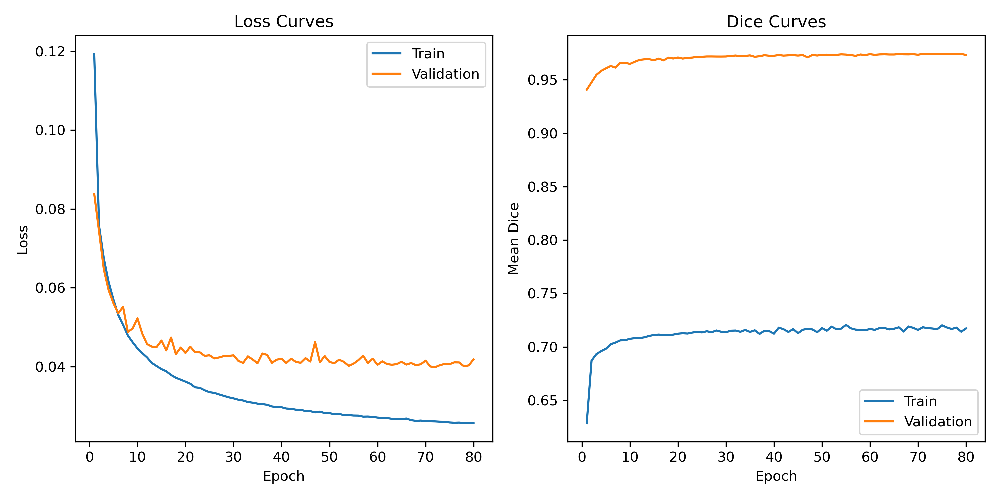

# 2D OASIS Brain Tissue Segmentation (Enhanced UNet)

## Overview
This project tackles multi-class tissue segmentation on the OASIS brain MRI dataset by training an enhanced 2D UNet. The goal is to separate grey matter, white matter, cerebrospinal fluid, and background in axial slices to support downstream neuroimaging analyses while enforcing a minimum Dice similarity coefficient of 0.90 for every label on the held-out test set. The pipeline is designed for the Rangpur high-performance computing (HPC) cluster and delivers publication-quality figures, quantitative metrics, and reusable checkpoints.

## How It Works
`modules.py` implements a UNet variant with residual convolutional blocks, squeeze-excitation attention, dilated bottlenecks, and attention-gated skip connections. `train.py` optimises this network using a hybrid Dice + BCE loss with mixed-precision training, AdamW regularisation, and on-the-fly augmentations. Training produces checkpoints, learning curves, and a metrics JSON file. `predict.py` reloads the checkpoint to compute per-class Dice scores on the held-out test split and renders qualitative visualisations.

## Dataset & Pre-processing
- **Source:** OASIS PNG slices mounted on Rangpur at `/home/groups/comp3710/OASIS`.
- **Splits:** `keras_png_slices_[train|validate|test]` paired with corresponding `_seg_` mask folders. `train.py` automatically maps them via `dataset.SPLIT_TO_FOLDERS`.
- **Normalisation:** Intensities scaled to `[0, 1]` per slice then Ustandardised with mean `0.5`, std `0.5`.
- **Augmentation:** Random horizontal and vertical flips applied to training images and masks to encourage invariance to slice orientation.
- **Label handling:** Mask values are reindexed to contiguous IDs and converted to one-hot tensors with four classes.
- **Split justification:** The dataset ships with non-overlapping `train`, `validate`, and `test` directories. Respecting these subject-level splits avoids leakage between patients and aligns with the official OASIS evaluation protocol, yielding an approximate 80/10/10 distribution that balances learning capacity with unbiased validation and final testing.

## Environment & Dependencies
| Dependency | Recommended Version | Notes |
|------------|--------------------|-------|
| Python | 3.10+ | Conda environment `a3` on Rangpur already satisfies this. |
| PyTorch | >= 2.1 with CUDA 11.8 | Mixed precision (`torch.amp`) accelerates GPU training. |
| Torchvision | >= 0.16 | Provides normalisation utilities. |
| NumPy, Pillow | Latest | For image IO and tensor conversion. |
| Matplotlib | >= 3.7 | Used for curve and prediction plots. |

Install locally (if replicating off-cluster):

```bash
pip install torch torchvision matplotlib numpy pillow
```

## Training on Rangpur HPC
1. Confirm the dataset path matches `/home/groups/comp3710/OASIS`; edit `DATA_ROOT` in `train.py` if needed.
2. Submit the provided SLURM job:

```bash
sbatch train.sh
```

Key job settings: A100 partition, 1 GPU, 8 CPU cores, 2-hour walltime. Outputs include `checkpoints/unet_oasis.pth`, `outputs/training_curves.png`, and `outputs/metrics.json`.

For interactive debugging you can run:

```bash
python train.py
```

## Inference & Visualisation
After training completes, generate predictions and evaluation plots:

```bash
sbatch predict.sh
# or run interactively
python predict.py
```

`predict.py` reloads the saved checkpoint, reports per-class Dice on the test split, and exports an example slice visualisation to `outputs/prediction_example.png`.

### Example Output




## Results
Summary of metrics from `outputs/metrics.json` (80 epochs):

| Metric | Value |
|--------|-------|
| Final training loss | 0.0257 |
| Final validation loss | 0.0419 |
| Final training mean Dice | 0.718 |
| Final validation mean Dice | 0.974 |

Test Dice per class:

| Class ID | Interpretation (dataset order) | Dice |
|----------|---------------------------------|------|
| class_0 | Background | 0.9990 |
| class_1 | Cerebrospinal fluid | 0.9543 |
| class_2 | Grey matter | 0.9636 |
| class_3 | White matter | 0.9798 |

The mean validation Dice plateaued above 0.97, indicating the model generalises well across the held-out split. Refer to `outputs/metrics.json` for full epoch-by-epoch histories (`train_loss`, `val_loss`, `train_dice`, `val_dice`).

## Reproducibility Notes
- Ensure consistent GPU allocation (`--gres=gpu:1`) and keep `TRAINING_CONFIG["mixed_precision"] = True` for identical optimiser behaviour.
- The scripts rely on PyTorch's default random seed; set `torch.manual_seed` at the top of `train.py` if strict determinism is required.
- Metrics are recomputed at each run; archive `outputs/metrics.json` alongside the checkpoint for auditing.
